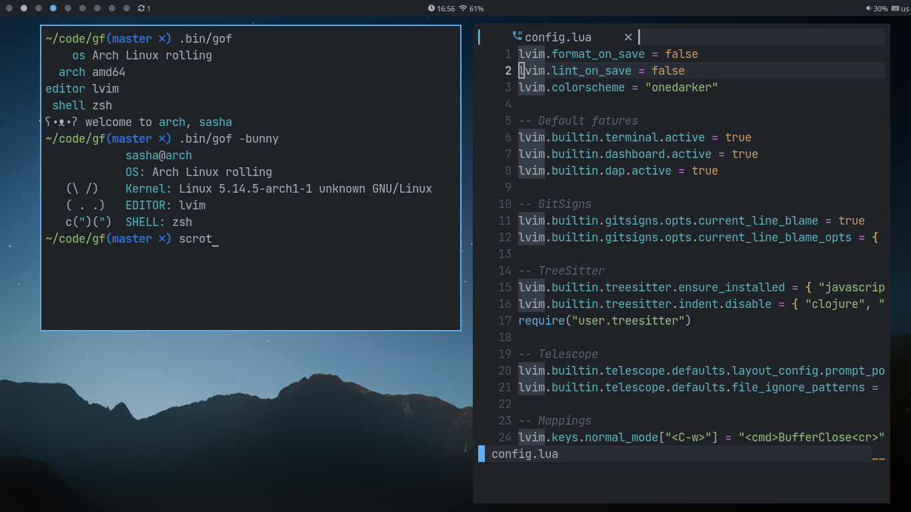

<h1 align="center">dotfiles</h1>


----------------------------

#### System configuration
- `OS` Arch
- `WM` bspwm, openbox
- `Terminal` kitty
- `Shell` zsh
- `Editor` nvim, vscode
- `File manager` ranger
- `Browser` firefox
- `Font` Jatbrains Mono
- `Icon font` Font Awesome
- `Launcher` rofi

#### Install config
Since i use **[rcm](https://github.com/thoughtbot/rcm)** set it:
```bash
yay -S rcm
```

Install dependency:
```bash
sudo pacman -S neovim tmux git openbox tint2 bspwm sxhkd kitty picom dunst zsh rofi ranger firefox ttf-font-awesome ttf-jetbrains
yay -S polybar
```

And install config:
```bash
git clone https://github.com/Smirnov-O/dotfiles .dotfiles
rcup
```
