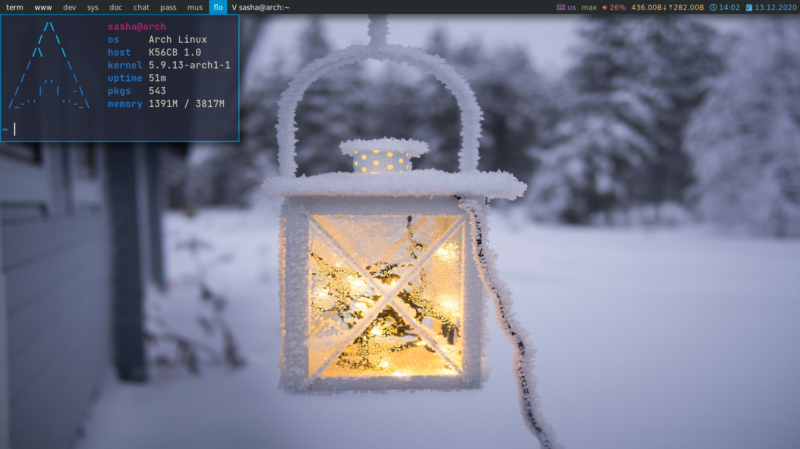

<h1 align="center">dotfiles</h1>

------------------------------

#### System configuration
- `OS` Arch
- `WM` Qtile
- `Terminal` Kitty
- `Shell` zsh
- `Editor` nvim
- `Browser` firefox
- `Font` Jatbrains Mono
- `Icon font` FontAwesome5
- `Launcher` dmenu, rofi

#### Install configs
Since i use **[rcm](https://github.com/thoughtbot/rcm)** set it
~~~bash
yay -S rcm
~~~

And install configs
~~~bash
git clone https://github.com/Smirnov-O/dotfiles .dotfiles
rcup
~~~
