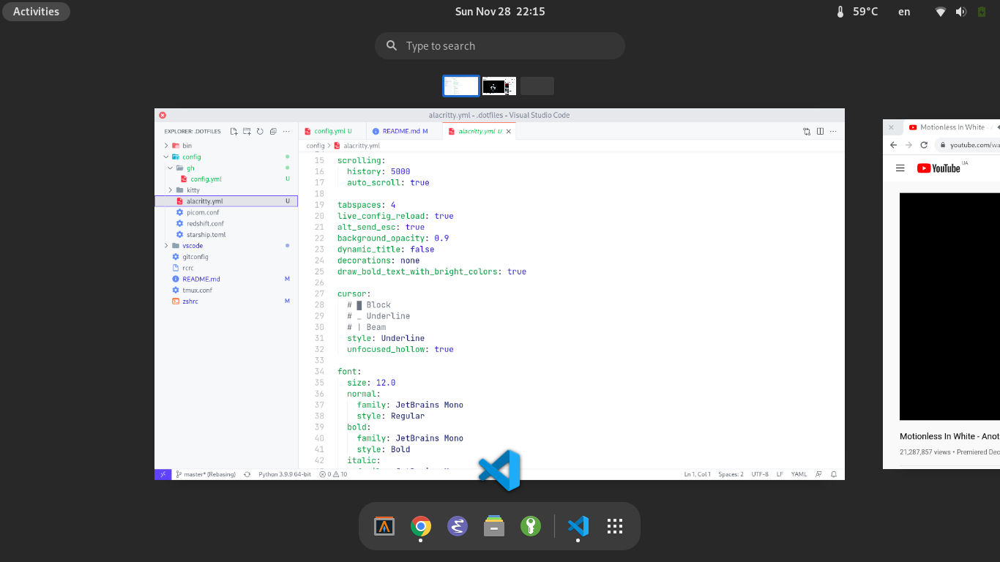

<h1 align="center">dotfiles</h1>


--------------------------------

## System info
- `OS` Arch linux
- `DE` Gnome 4
- `Terminal` Alacritty
- `Editors` nvim, vscode
- `Browser` chrome, firefox
- `Font` Jatbrains Mono

## Install dependencys
```bash
sudo pacman -S git alacritty github-cli neovim tmux zsh ttf-jetbrains-mono
paru -S rcm visual-studio-code-bin
```

## And install deps
```bash
git clone --recursive https://github.com/Smirnov-O/dotfiles ~/.dotfiles
rcup rcrc && rcup
```

## Gonome extensions
- [Freon](https://extensions.gnome.org/extension/841/freon)
- [DDTerm](https://extensions.gnome.org/extension/3780/ddterm)
