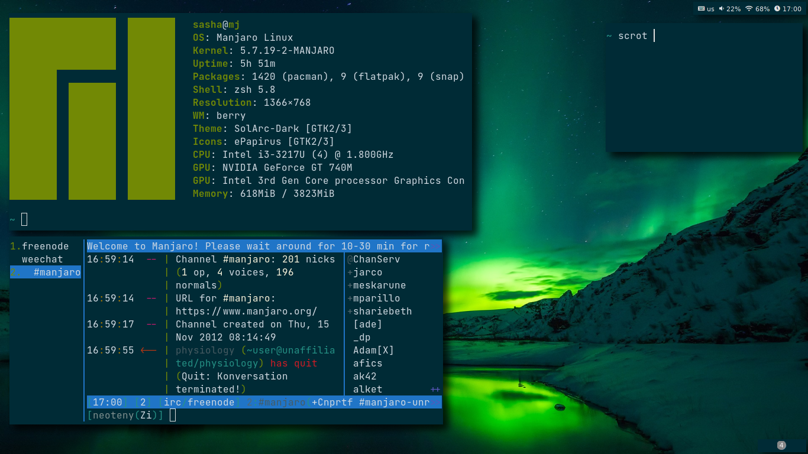

# [Berry](https://berrywm.org)

-------------------------

Install `sxhkd` 
~~~bash
sudo pacman -S sxhkd
~~~

Install `berry` from source
~~~bash
sudo pacman -S libx11 libxft libxinerama
git clone https://github.com/JLErvin/berry
cd berry
make && sudo make install
~~~

Add berry in lightdm
~~~bash
sudo cat <<EOF > /usr/share/xsessions/berry.desktop
[Desktop Entry]
Encoding=UTF-8
Name=berry
Comment=berry - a small window manager
Exec=berry
Type=XSession
EOF
~~~

### Autostart
~~~bash
setxkbmap "us,ru,ua" ",winkeys" "grp:alt_shift_toggle" -option "ctrl:nocaps"
sxhkd -c ~/.config/berry/sxhkdrc &
~/.config/berry/polybar/bar.sh &
nitrogen --restore &
picom -b &
~~~

### Keybindings
---------------

| Shourtcut                 | Command                                                                                                  |
| ------------------------- | ------                                                                                                   |
| `mod` + q                 | Kill focus window                                                                                        |
| `mod` + `split` + enter   | Run program launcher (Rofi)                                                                              |
| `mod` + esc               | Power [menu](https://github.com/Smirnov-O/dotfiles/blob/master/scripts/dmenu/dmenu-power.sh)             |
| `mod` + `ctrl` + u        | Config edit [menu](https://github.com/Smirnov-O/dotfiles/blob/master/scripts/dmenu/dmenu-config-edit.sh) |
| `mod` + `ctrl` + i        | Passmenu(Dmenu interface for [pass](https://passwordstore.org))                                          |
| `mod` + enter             | Run `kitty`                                                                                              |
| `mod` + F2                | Run `firefox`                                                                                            |
| `mod` + `shift` + esc     | Run `xkill`                                                                                              |
| `mod` + plus              | Add 5% volume                                                                                            |
| `mod` + minus             | Minus 5% volume                                                                                          |
| `mod` + `shift` + minus   | Mute volume                                                                                              |
| `mod` + tab               | Change focus window                                                                                      |
| `mod` + h/j/k/l           | Move focus window                                                                                        |
| `mod` + `shift` + h/j/k/l | Resize focus window                                                                                      |
| `mod` + [1-9]             | Change workspace                                                                                         |
| `mod` + `shift` + [1-9]   | Send focus window to workspace                                                                           |
| `mod` + `alt` + t         | Open ~/.todo file                                                                                        |
