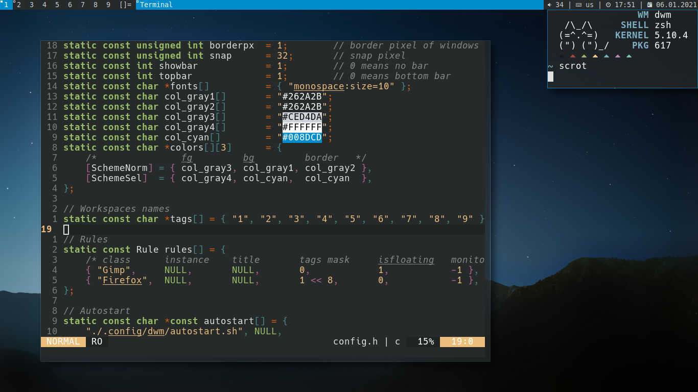

# DWM

------------------------

### Install
~~~bash
git clone https://git.suckless.org/dwm ~/.config/dwm
sudo cp ~/.config/dwm/dwm.desktop /usr/share/xsessions
cd ~/.config/dwm
sudo make clean install
~~~~
