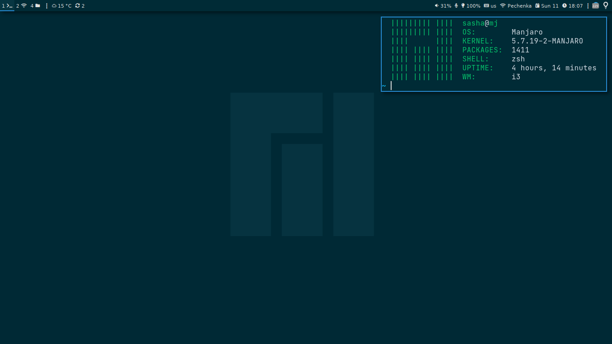

# [i3](https://i3wm.org)

----

### Install
-----------
~~~bash
sudo pacman -S i3-gaps polybar
~~~

**Mod key:** `super(win)`
**Font:** `monospace 10`, `JetBrains Mono 10`

### Auttostart
--------------
~~~bash
nmcli radio wifi on; nmcli device wifi connect <wifi_name> password <wifi_pass> name net
setxkbmap "us,ru,ua" ",winkeys" "grp:alt_shift_toggle" -option "ctrl:nocaps"
org.telegram.desktop
nitrogen --restore
redshift-gtk
picom -b
~~~

### Variables
-------------
~~~i3
set $terminal kitty
set $browser qutebwoser
set $filemanager pcmanfm
~~~

### Keybindings
---------------

| Shourtcut                         | Command                                                                                                  |
| -----------------------           | ------                                                                                                   |
| `mod` + q                         | Kill focus window                                                                                        |
| `mod` + `ctrl` + r                | Restart i3                                                                                               |
| `mod` + a                         | Focus thr oarent container                                                                               |
| `mod` + `shift` + space           | Enable/disable floating mode                                                                             |
| `mod` + F11                       | Enable/disable fullscreen mode                                                                           |
| `mod` + h/v                       | Horisontal/Vertical split                                                                                |
| `mod` + s/w/e                     | Container mode Stacked/Tabbed/Split                                                                      |
| `mod` + `shift` + ~               | Move focus window to scratchpad                                                                          |
| `mod` + ~                         | Show window from scratchpad                                                                              |
| `mod` + `shift` + enter           | Run program launcher (Rofi)                                                                              |
| `mod` + esc                       | Power [menu](https://github.com/Smirnov-O/dotfiles/blob/master/scripts/dmenu/dmenu-power.sh)             |
| `mod` + `ctrl` + u                | Config edit [menu](https://github.com/Smirnov-O/dotfiles/blob/master/scripts/dmenu/dmenu-config-edit.sh) |
| `mod` + `ctrl` + i                | Passmenu(Dmenu interface for [pass](https://passwordstore.org))                                          |
| `mod` + tab                       | Window switcher(Rofi)                                                                                    |
| `mod` + enter                     | Run program from `$terminal` variable(default: kitty)                                                    |
| `mod` + F2                        | Run program from `$browser` variable(default: qutebwoser)                                                |
| Print Screen                      | Screenshot                                                                                               |
| `mod` + plus                      | Add 5% volume                                                                                            |
| `mod` + minus                     | Minus 5% volume                                                                                          |
| `mod` + `shift` + minus           | Mute volume                                                                                              |
| `mod` + Arrow/(h/j/k/l)           | Change focus window                                                                                      |
| `mod` + `shift` + Arrow/(h/j/k/l) | Move focus window                                                                                        |
| `mod` + [1-9]                     | Change workspace                                                                                         |
| `mod` + `shift` + [1-9]           | Send focus window to workspace                                                                           |
| `mod` + `alt` + t                 | Open ~/.todo file                                                                                        |
| `mod` + r                         | Enable/disable `resize` mode                                                                             |
| `mod` + g                         | Enable/disable `gups`                                                                                    |

### Rules
---------
Open `kitty` on `1` workspace

Open `chromium, `firefox`, `qutebwoser` on `2` workspace

Open `sublime`, `code`, `emacs` on `3` workspace

Open `thunar`, `pcmanfm` on `4` workspace

Open `discord`, `telegram` on `6` workspace

Open `keepassxc` on `7` workspace

Open `mousepad`, `lxappeatance`, `qt5ct`, `notrogen` in floating mode

### Modes
---------

**Resize:** chande window size

**Gups:** edit gups size

| Keys for `resize` mode  | What is he doing           |
| --------------------    | -------------------------- |
| Arrow / (h/j/k/l)       | Change window size on 10px |
| enter / esc / `mod` + r | Exit from resize mode      |

| Keys for `gups` mode    | What is he doing           |
| --------------------    | -------------------------- |
| plus / minus            | Plus/Minus 2px gups        |
| 0                       | Set `0` gups               |
| `shift` + plus/minus    | Plus/Minus 4px gups        |
| enter / esc / `mod` + g | Exit from resize mode      |
