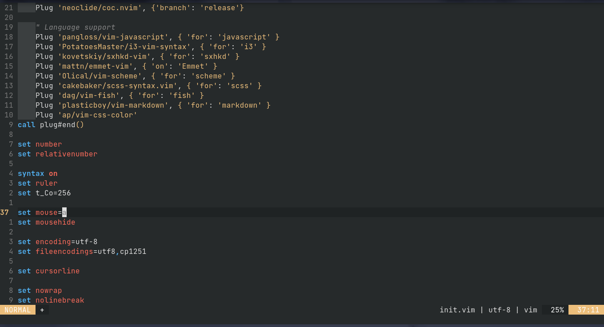

# nvim

---------------

To manage plugins, I use [vim plug](https://github.com/junegunn/vim-plug). I use the following plugins:
- `nten16.vim`: Colorschemes
- `lightline`: Status bar
- `vim-indent-guides`: Visually displaying indent levels
- `vim-easymotion`: Fast navigation
- `nerdtree`: File manager
- `vim-devicons`: Icons for nerdtree
- `ctrlp.vim`: File saecher
- `auto-pairs`: Close brackets, parens, quotes
- `coc.nvim`: Instant completion
- `emmet-vim`: Emmet :D
- `vim-javascript`: Syntax support for JS
- `i3-vim-syntax`: Syntax support for i3
- `sxhkd-vim`: Syntax support for sxhkd
- `vim-scheme`: Syntax support for scheme
- `scss-syntax.vim`: Syntax support for scss
- `vim-fist`: Syntax support for fish
- `vim-css-color`: Color name highlighter
- `vim-markdown`: Syntax support for fish
- `markdown-preview.nvim`: Preview markdown in real-time
- `vim-table-mode`: Automatic markdown table creator & formatter
